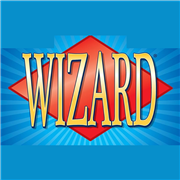

# Wizard Scores

<p align="center">
  
</p>

<p align="center">
  A fast, offline-capable scorekeeper for the Wizard card game, designed for iPhone and the game table.
</p>

## About

Wizard Scores is an installable Progressive Web App (PWA) for tracking a complete game of Wizard one round at a time. It runs entirely in the browser, requires no account or backend, and stores game data locally on the device.

The app is mobile-first, but it also works in modern desktop browsers.

**Open the app:** <https://sanderk225.github.io/Wizard/>

## Features

- Standard games for 3 to 6 players
- Automatic round count and clockwise dealer rotation
- Ordered bidding beginning with the player after the dealer
- Trump selection, including no-trump and the automatic no-trump final round
- Fast bid and tricks-won steppers optimized for repeated taps
- Free-order tricks entry with automatic zero handling
- Wizard scoring and cumulative totals calculated automatically
- Bid and trick corrections before a round is saved
- Final ranking and winner summary
- Traditional all-player, all-round scorecard containing:
  - Bid
  - Tricks won
  - Score for the round
  - Cumulative score through the round
- Built-in Wizard rules and FAQ reference
- Local game history and JSON backup export
- Offline operation after the first successful load
- iPhone Home Screen installation with a standalone app experience

## Install on iPhone

1. Open the published GitHub Pages address in **Safari** on the iPhone.
2. Tap the **Share** button.
3. Select **Add to Home Screen**.
4. Keep the name **Wizard Scores**, then tap **Add**.
5. Open the app from its new Home Screen icon while online once so all offline files can be cached.

For first-time publishing, detailed installation steps, updates, and troubleshooting, see [Install Wizard Scores on an iPhone](INSTALL_ON_IPHONE.md).

## Privacy

Wizard Scores has no accounts, analytics, advertising, cookies, or remote score storage.

Player names, bids, tricks, scores, and game history remain in browser storage on the device. They are not uploaded to GitHub. Clearing Safari website data can erase saved games, so use **Export backup** before clearing browser data or resetting the phone.

The current version exports backup data as JSON but does not yet import it.

## Run Locally

The application is plain HTML, CSS, and JavaScript. It has no package dependencies and no build step. Serve the `app` directory over HTTP rather than opening `index.html` directly.

Using Python:

```powershell
python -m http.server 4173 --directory app
```

Then open <http://localhost:4173>.

You can also use any static web server or a VS Code extension that serves the `app` directory over HTTP.

## Tests

With the local server running, open:

<http://localhost:4173/tests.html>

The browser test suite covers round counts, dealer and bidding order, no-trump behavior, score calculation, implicit zero tricks, cumulative totals, the complete scorecard data, and rules content.

## Deploy to GitHub Pages

The workflow at [.github/workflows/deploy-pages.yml](.github/workflows/deploy-pages.yml) publishes the `app` directory to GitHub Pages whenever a change is pushed to `main`. No build job is required.

To enable it for the first time:

1. Open the repository on GitHub.
2. Select **Settings > Pages**.
3. Set **Source** to **GitHub Actions**.
4. Open **Actions > Deploy Wizard Scores**.
5. Run the workflow if a deployment has not already started.
6. Find the published address under **Settings > Pages** after the workflow succeeds.

## Updating the App

1. Commit changes to `main`.
2. Push the commit to GitHub.
3. Wait for **Deploy Wizard Scores** to finish successfully.
4. Open the installed app while online, wait several seconds, then close and reopen it.

The versioned service worker replaces cached application files without deleting locally stored game data. iOS may retain an existing Home Screen icon; after an icon change, remove only the Home Screen shortcut and add it again from Safari.

## Project Structure

```text
.
|-- app/
|   |-- index.html             Application shell and PWA metadata
|   |-- app.js                 UI rendering and interaction handling
|   |-- core.js                Wizard game and scoring rules
|   |-- storage.js             Local persistence and backup export
|   |-- rules.js               Embedded rules and FAQ content
|   |-- styles.css             Mobile-first Wizard theme
|   |-- manifest.webmanifest   Installation metadata
|   |-- sw.js                  Offline service worker
|   `-- tests.html / tests.js  Browser test runner
|-- .github/workflows/
|   `-- deploy-pages.yml       GitHub Pages deployment
|-- INSTALL_ON_IPHONE.md       Publishing and installation guide
`-- Wizard_iOS_App_UX_Design.md
```

## Design Documentation

The product behavior, workflows, visual system, accessibility decisions, persistence model, and acceptance checks are documented in [Wizard_iOS_App_UX_Design.md](Wizard_iOS_App_UX_Design.md).

## Disclaimer

This is an unofficial scorekeeping companion and is not affiliated with, endorsed by, or sponsored by the publisher or trademark owners of Wizard. Wizard and associated names, artwork, and trademarks belong to their respective owners.
