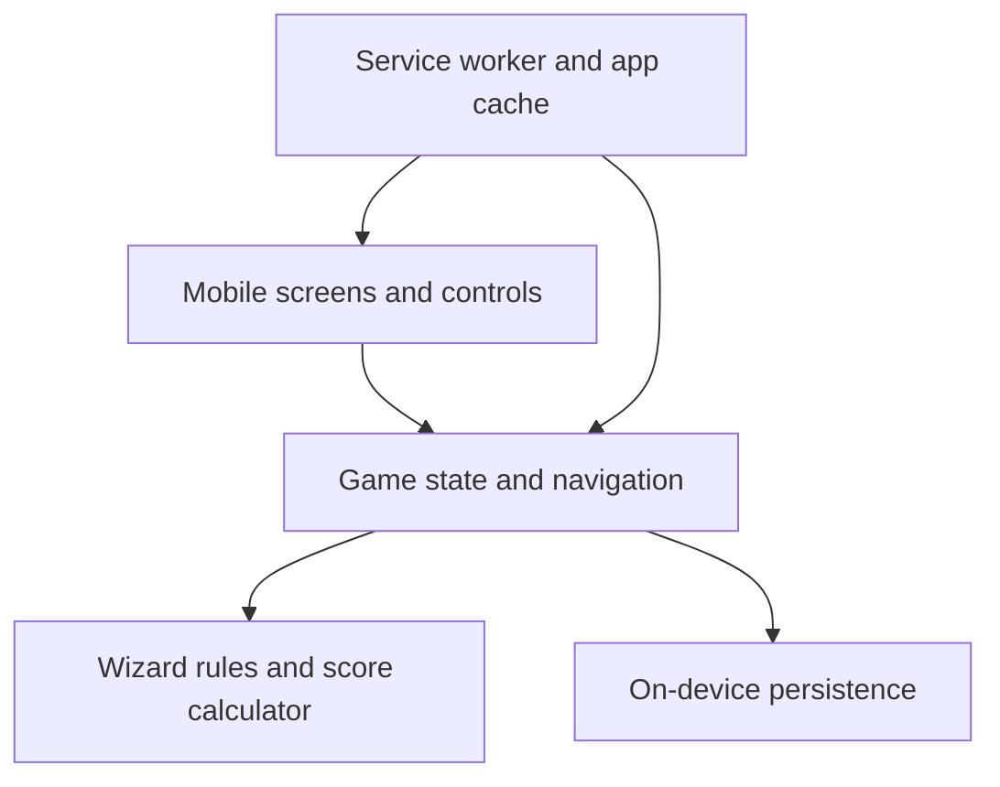

# Wizard Card Game - iOS Score Tracking App
## User Experience Design Proposal

---

## Overview

This proposal outlines a mobile-first UX for tracking Wizard card game scores. Unlike the paper scoresheet (which shows all rounds at once), this app uses a **single-round focused view** optimized for phone interaction during gameplay.

**Design Philosophy:**
- One round at a time to reduce cognitive load
- Minimal taps to complete data entry
- Clear visual feedback for scoring calculations
- Quick navigation to previous/next rounds and overall standings

---

## Core Screens

### 1. **Game Setup Screen**
*First time user experience or starting a new game*

**Purpose:** Configure the game before beginning

**Key Elements:**
- **Player Name Entry:** Add 3-6 players via text input
  - "+ Add Player" button
  - Remove player option (trash icon)
  - Display current player count vs. max (3-6)
- **Auto-Calculate Rounds:** Dropdown or auto-filled field
  - 3 players → 20 rounds
  - 4 players → 15 rounds
  - 5 players → 12 rounds
  - 6 players → 10 rounds
- **First Dealer:** Select the initial dealer; the dealer rotates clockwise each round
- **Player Order:** Arrange players clockwise once during setup; this controls dealer rotation and bidding order
- **"Start Game" Button:** Prominent CTA

**Layout:**
```
┌─────────────────────────┐
│     Wizard Game Setup    │
├─────────────────────────┤
│ Players:                │
│ ┌──────────────────┐   │
│ │ Player 1    ✕    │   │
│ │ Player 2    ✕    │   │
│ │ Player 3    ✕    │   │
│ │ + Add Player     │   │
│ └──────────────────┘   │
│                         │
│ Total Rounds:      15   │
│ ┌─────────────────┐    │
│ │  4 players      │    │
│ │  15 rounds      │    │
│ └─────────────────┘    │
│                         │
│ ┌─────────────────────┐ │
│ │   START GAME        │ │
│ └─────────────────────┘ │
└─────────────────────────┘
```

---

### 2. **Round Scoring Screen**
*Main gameplay interface - shown one round at a time*

**Purpose:** Enter bids and actual tricks won, display round results

**Section A: Round Header**
- Round number and progress indicator (e.g., "Round 5 of 15")
- Current dealer and first bidder (the player immediately clockwise from the dealer)
- Trump selector with five explicit values: ♠, ♥, ♦, ♣, and **None**
  - Select **None** when a Jester is revealed or when no undealt card remains, as in a standard final round
  - If a Wizard is revealed, the dealer chooses one of the four suits
- After selection, show the trump symbol as an oversized, immediately recognizable round-header element rather than inline text
- Header actions: return home or open standings; completed rounds are accessed from the standings history

**Section B: Player Bid Entry**
- **During Bidding Phase:** Players bid clockwise, starting with the player immediately after the dealer
  - Sort the list into bidding order, with the first bidder at the top and the dealer last
  - Enable every player's stepper immediately; the ordering communicates who should bid next without forcing UI confirmation between players
  - Tapping the displayed **0**, **+**, or **−** counts as entering that player's bid; untouched zero and an explicitly entered bid of zero remain visually distinct
  - Entered bids remain directly editable until the whole list is confirmed
  - Stepper buttons (+ / -) constrain the bid from 0 through the number of cards in the round
  - Cumulative bid total at bottom with "The Hook" indicator
  - A single **Confirm All Bids** action becomes available after every player has an explicit bid

**Section C: Player Tricks Tracking**
- **During Play Phase:** After all bids entered, switch to "Tricks Won" input
  - Player name (left)
  - Current bid display (light text)
  - Tricks won field with stepper buttons; all players are enabled and may be entered or corrected in any order
  - Instant point calculation showing below each entry
  - Running tricks total must equal the number of tricks in the round before scores can be confirmed
  - Players whose tricks remain untouched are treated as winning zero tricks once the entered values add up to the round total; users do not need to tap every zero

**Section D: Round Results**
- After all entries: show per-player scores for this round
- Show bid and tricks won beneath each player name
- Present **Round** and **Total** as two labeled, right-aligned numeric columns using equal-size tabular numerals; reserve enough width for total scores in the hundreds
- An **Edit Round** action reopens bids or tricks; saving the correction recalculates this and all later cumulative totals

**Layout - Bid Phase:**
```
┌─────────────────────────────┐
│   Round 5 of 15      ♥      │
│ Dealer: Player 4 · First: P1 │
├─────────────────────────────┤
│ BIDDING · Start at the top  │
├─────────────────────────────┤
│ 1  Player 1          [− 0 +]│
│ 2  Player 2          [− 2 +]│
│ 3  Player 3          [− 1 +]│
│ 4  Player 4          [− 2 +]│
│                             │
│ Total bids: 5 of 5 tricks   │
│                             │
│ ┌──────────────────────────┐│
│ │    CONFIRM ALL BIDS      ││
│ └──────────────────────────┘│
└─────────────────────────────┘
```

**Layout - Tricks Phase:**
```
┌─────────────────────────────┐
│   Round 5 of 15      ♥      │
├─────────────────────────────┤
│ TRICKS WON                  │
├─────────────────────────────┤
│ Player 1  Bid: 0   Won: [0] │
│           Points: +20       │
│                             │
│ Player 2  Bid: 2   Won: [3] │
│           Points: -10       │
│                             │
│ Player 3  Bid: 1   Won: [—] │
│           Untouched = zero  │
│                             │
│ Player 4  Bid: 2   Won: [—] │
│           Untouched = zero  │
│                             │
│ Tricks entered: 5 of 5      │
│ Edit bids                    │
│                             │
│ ┌──────────────────────────┐│
│ │       SCORE ROUND        ││
│ └──────────────────────────┘│
│       Correct bids          │
└─────────────────────────────┘
```

**Design Notes:**
- Use color coding for quick visual feedback:
  - **Green:** Correct bid (points earned)
  - **Red:** Incorrect bid (points lost)
  - **Gray:** Neutral/entry state
- Stepper buttons (⊕/⊖) for faster input than keyboard
- Real-time calculation as user enters values
- Trump and bids use explicit unset states; a bid of zero must be entered explicitly
- Tricks may remain unset: when entered tricks equal the round total, all untouched trick values are converted to zero before review

---

### 3. **Leaderboard / Standings Screen**
*View current scores and game progress*

**Purpose:** See cumulative scores after each round or check anytime

**Key Elements:**
- Player rankings sorted by total score (highest first)
- Round-by-round breakdown in collapsible accordion or detail view
- Current round indicator
- "Game Summary" option to see all scores

**Layout:**
```
┌──────────────────────────────┐
│   Standings - Round 5/15      │
├──────────────────────────────┤
│ 1. Player 3         +185 pts  │
│    (Bid: 1, Won: 1, +30 this) │
│                               │
│ 2. Player 1         +140 pts  │
│    (Bid: 0, Won: 0, +20 this) │
│                               │
│ 3. Player 2         +105 pts  │
│    (Bid: 2, Won: 3, -10 this) │
│                               │
│ 4. Player 4          +75 pts  │
│    (Bid: 2, Won: 1, -10 this) │
│                               │
│ ┌──────────────────────────┐ │
│ │  ← Back to Scoring       │ │
│ └──────────────────────────┘ │
└──────────────────────────────┘
```

---

### 4. **Game Summary Screen**
*End of game results*

**Purpose:** Show final winner and detailed breakdown

**Key Elements:**
- **Winner Banner:** Highlight the top player
- **Final Rankings:** All players with final scores
- **Game Statistics:**
  - Highest single-round score
  - Most consistent player
  - Best bid accuracy
- **Options:**
  - Start new game
  - Export scores (email/SMS)
  - Share results

**Layout:**
```
┌──────────────────────────────┐
│     GAME OVER - 15/15        │
├──────────────────────────────┤
│          🏆                  │
│      Player 3 WINS!          │
│      Final Score: 520 pts    │
│                              │
│ FINAL RANKINGS:              │
│ 1. Player 3        520 pts   │
│ 2. Player 1        425 pts   │
│ 3. Player 4        310 pts   │
│ 4. Player 2        285 pts   │
│                              │
│ STATS:                       │
│ Best Round: Player 3 (Rd 8)  │
│ Most Bids Hit: Player 1 (9/15)│
│                              │
│ ┌──────────────────────────┐ │
│ │   New Game               │ │
│ └──────────────────────────┘ │
│ ┌──────────────────────────┐ │
│ │   Share Results          │ │
│ └──────────────────────────┘ │
└──────────────────────────────┘
```

---

### 5. **Rules & FAQ Screen**
*Browsable reference available without leaving or resetting the game*

**Purpose:** Let players resolve rules questions at the table and return immediately to the exact gameplay screen they left.

**Entry Points:**
- A familiar **?** icon in gameplay and application headers, with the accessibility label and tooltip "Rules & FAQ"
- A labeled **Rules & FAQ** secondary action on Home

**Content:**
- Deck and card ranking
- Setup, dealing, dealer rotation, and trump selection including no trump
- Ordered bidding and The Hook
- Following suit, Wizard behavior, Jester behavior, and trick resolution
- Exact scoring with examples
- FAQ covering player count, special-card edge cases, final-round trump, regular-deck substitutions, and corrections

**Return Behavior:**
- Opening Rules & FAQ stores the current route and viewed round without modifying game data
- A back arrow in the header and a fixed **Return to game** action both restore the exact screen and scroll-independent gameplay state
- When opened from Home, the return action reads **Return home**
- Scrolling the rules never triggers score entry, persistence, or phase changes

**Layout:**
```
┌─────────────────────────────┐
│ ←       Rules & FAQ         │
├─────────────────────────────┤
│ PLAYING A TRICK             │
│ Players must follow suit... │
│                             │
│ FAQ                         │
│ Can I play a Wizard when... │
│ Yes. Wizards and Jesters... │
│                             │
├─────────────────────────────┤
│       RETURN TO GAME        │
└─────────────────────────────┘
```

---

## User Flow

### Typical Gameplay Session:

```
1. SETUP
   ↓
2. START ROUND N
  ├─→ Display dealer and select trump suit, including None
   ├─→ Bidding Phase
  │   └─ Enter bids clockwise, starting after the dealer
  └─→ Confirm All Bids once (Advance to Tricks)
   
3. TRICKS PHASE
   ├─→ Display current bids for reference
  ├─→ Enter tricks won in any player order
   ├─→ View real-time point calculations
  ├─→ Validate that tricks won total equals tricks available
  └─→ Score Round
   
4. POST-ROUND
   ├─→ Show round results
   ├─→ Option: View Standings
   ├─→ Option: Continue to Next Round
   └─→ If Round N = Total Rounds → Game Over
```

---

## Key UX Features

### 1. **Stepper Controls for Number Entry**
Why: More reliable than tapping number pad on phone
- Buttons (- / +) flanking the input field
- Tap-and-hold to increment rapidly
- Max/min constraints (0 to hand size)

### 2. **Trump Suit Visual**
- Five-option segmented control: ♠, ♥, ♦, ♣, **None**
- Color coded (black spades/clubs, red hearts/diamonds)
- Use a substantially larger symbol in the persistent round header so trump can be recognized at a glance from across the table
- Show **No Trump** prominently when **None** is selected
- Default the standard final round to **None** because all cards are dealt; allow correction in case custom rules are used

### 3. **The Hook Indicator**
- Display total bids vs. available tricks in real-time
- When total bids equal available tricks, show: "The Hook is in play: at least one player must miss."
- Helps players understand when they'll be penalized

### 4. **Undo/Edit Capability**
- **During bidding:** Every ordered row remains editable until **Confirm All Bids** is selected; no per-player confirmation or back navigation is required
- **During tricks entry:** Every row remains enabled, so values can be entered and corrected in any order
- Place a compact **Correct Bids** action below **Score Round**, keeping the scoring action visually primary
- **After bids are confirmed:** An **Edit Bids** action returns to bidding and preserves entered tricks; changed bids immediately recalculate score previews
- Place a compact **Correct Tricks** action below **Save & Start Next Round** on the review screen
- **After a round is completed:** **Edit Round** opens the saved round with **Cancel** and **Save Corrections** actions
- Saving a past-round correction recalculates cumulative standings from that round onward and displays a concise before/after score summary
- A completed round is never silently overwritten; navigating back is read-only until **Edit Round** is selected

### 5. **Keyboard Avoidance**
- Stepper buttons minimize keyboard entry
- If keyboard appears, rest of screen scrolls up naturally
- Large tap targets (minimum 44x44 pt for accessibility)

---

## Detailed Screen: Round Scoring

### State 1: Awaiting Bids
```
Header shows:
- Round 5 of 15
- Dealer: Player 4; first bidder: Player 1
- Trump selector: ♠ | ♥ | ♦ | ♣ | None
- Progress bar: ████░░░░░░ (5/15)

Main content:
- Title: "BIDDING PHASE - 5 tricks available"
- All players listed in clockwise bidding order, beginning with the player after the dealer
- Every row has an enabled [- n +] control
- Tapping 0, +, or − creates an explicit bid; values can be corrected directly
- Running total at bottom with The Hook status
- "Confirm All Bids" button (disabled until all players have an explicit bid)
```

### State 2: Confirming Bids
```
Same as State 1 but with:
- "Confirm All Bids" button becomes enabled
- Option to correct any player's bid before advancing
- One confirmation advances the complete table to tricks entry
```

### State 3: Awaiting Tricks
```
Header shows:
- Same as above
- Phase indicator: "TRICKS WON PHASE"

Main content:
- For each player: display their bid prominently
- Tricks won input fields are all enabled and can be completed in any order
- Real-time score calculation displayed
  Example: "Bid: 2, Won: 2 → 20 + (10×2) = +40 points"
- Running tricks total at bottom (for example, "3 of 5 assigned")
- "Score Round" button, enabled as soon as assigned tricks equal the round number; untouched players are saved as zero
- Compact "Correct Bids" action directly below "Score Round"
```

### State 4: Round Review
```
Header shows:
- Round 5 of 15

Results section:
- One aligned row per player showing:
  - Player name
  - Bid / Tricks Won
  - Equal-size, aligned **Round** and **Total** score columns
- "Save & start round 6" button
- Compact "Correct Tricks" action directly below the save button
- Standings remains available from the header
- Saving commits the round and updates cumulative standings
```

### State 5: Saved Round
```
Completed rounds are opened from standings in read-only mode.
An "Edit Round" action reopens trump, bids, or tricks using a draft.
"Save Corrections" recalculates standings from that round onward.
```

---

## Mobile-Specific Considerations

### Orientation
- **Portrait:** Primary orientation (how scoresheet is viewed)
- **Landscape:** Optional expanded view with more context
- Graceful adaptation if user rotates phone mid-round

### Accessibility
- High contrast for number displays
- Large tap targets (44pt minimum)
- Clear labels for stepper buttons
- Support for VoiceOver (iOS accessibility)

### Dark Mode
- The current implementation uses a deliberate high-contrast light theme
- Native dark mode is deferred; when added, it must preserve green/red score contrast

### Performance
- Lightweight data model (scores per player per round)
- Instant calculation (no delay on input)
- Animate only actual screen or phase transitions
- Same-screen bid and trick changes must preserve header, content, footer, and scroll geometry with no entrance animation
- Reserve space for conditional messages such as The Hook so appearing text does not shift controls
- Local storage (no cloud required for basic game)

---

## Navigation Architecture

```
┌─ Game Setup ────────┐
│                     │
└─────────┬───────────┘
          │
          ↓
┌─ Round Scoring ─────────┐
│  ├─ Bidding Phase      │
│  ├─ Tricks Phase       │
│  └─ Results Review    │
│                        │
│  [View Standings] ←────┼─→ ┌─ Leaderboard ───────┐
│                        │   └──────────────────────┘
│  [Rules & FAQ] ←───────┼─→ ┌─ Rules Reference ──┐
│                        │   └─────────────────────┘
│  [Next Round] ─────────┤
│                        │
└────────┬───────────────┘
         │
         ↓ (After Round N)
┌─ Game Summary ──────┐
│  └─ Final Results   │
└─────────────────────┘
```

---

## Sample Interaction: Complete Round

### Step 1: Display Round
User sees Round 5, Player 4 as dealer, Player 1 as first bidder, and selects trump ♥. **None** is equally available and is preselected for a standard final round.

### Step 2: Bidding
- Player 1 appears at the top because they sit immediately after the dealer
- User taps + twice to enter Player 1's bid of 2, then moves directly to Player 2 without another action
- Players 2, 3, and 4 follow in clockwise order down the screen
- If a bid was entered incorrectly, the user adjusts that row directly before confirming the complete table
- Total shows: 5 bids for 5 tricks available
- The Hook warning displays

### Step 3: Confirm All Bids
- After every row has an explicit value, the user taps **Confirm All Bids** once
- Screen transitions to tricks phase

### Step 4: Tricks Entry
- User sees each player's name + their bid
- User may tap players in any order to enter or correct tricks won
- Real-time scores calculate:
  - Player 1: Bid 2, Won 2 → +40 ✓ (green)
  - Player 2: Bid 1, Won 3 → -20 ✗ (red)
  - Player 3: Bid 1, Won 0 → -10 ✗ (red)
  - Player 4: Bid 1, Won 0 → -10 ✗ (red)
- The app confirms that the tricks total is exactly 5 before enabling score confirmation
- Any untouched player is interpreted as zero once the total reaches 5

### Step 5: Confirm Scores
- User taps "Score Round"
- Untouched tricks are converted to zero and the aligned Round Review opens
- Scores remain editable at this stage
- If an error is noticed later, **Edit Round** reopens the saved values; **Save Corrections** recalculates affected standings

### Step 6: Continue or View
- User taps "Save & start round 6" to commit scores and update cumulative totals
- "Correct Tricks" remains available directly below the save action
- Optional: Open standings from the header to see the current leaderboard
- Back to Step 1 for next round

---

## Data Persistence & Storage

### Local Storage Requirements:
- Game session data (players, scores by round)
- Option to save multiple games
- Continue interrupted game

### Optional Features (Future):
- Cloud sync across devices
- Statistics tracking
- Export to CSV/PDF
- Import a previously exported JSON backup

---

## Overall Application Design

### Recommended Form: Installable Progressive Web App

Build the application as a small **Progressive Web App (PWA)** rather than a native App Store application. It opens as a website for the first visit, then installs from Safari using **Share → Add to Home Screen**. After installation it launches from its own icon in a standalone, app-like window.

This is the simplest personal deployment because it requires:
- No App Store submission or review
- No Apple Developer account or annual fee
- No device registration, signing certificate, or provisioning profile
- No authentication, server, or database
- No reinstall when a new version is published

A native Swift app would provide deeper iOS integration, but for this scorekeeper it adds signing and deployment work without providing a meaningful gameplay benefit. Direct sideloading is also less convenient because free Apple development signatures expire and normally require a Mac with Xcode.

### Technical Structure

Use a static client-side application with four small layers:



1. **Interface:** Responsive HTML and CSS designed primarily for iPhone portrait orientation.
2. **Game state:** Holds the active game, current round, current phase, ordered bid entries, and draft edits.
3. **Rules engine:** Pure functions calculate dealer rotation, bidding order, round validation, and scores. Keeping this independent from the UI makes the important game rules easy to test.
4. **Persistence:** Save the complete game locally after every meaningful action so closing Safari never loses progress.
5. **Service worker:** Cache the application shell so an installed game opens and works without an internet connection.

The implemented application uses dependency-free JavaScript modules, HTML, and CSS with no build step. This keeps deployment to static hosting simple and the offline download small. A framework can be introduced later if the interface grows substantially, but it is not needed for the current scorekeeper.

### Application Shell

Use one full-screen shell with these views:
- **Home:** Resume the active game or start a new one
- **Setup:** Enter clockwise player order and select the first dealer
- **Round:** Select trump, collect ordered bids, then collect tricks in any order
- **Round Review:** Confirm scores or reopen values for correction
- **Standings:** Show cumulative ranking and access completed rounds
- **Game Summary:** Final ranking and start-new-game action
- **Rules & FAQ:** Browse the embedded reference and return to the exact originating view

Avoid persistent tab navigation because scoring is a linear task. Use a compact top bar for round context, standings access in the header, and one primary action at the bottom. Small correction actions sit below the relevant primary action without competing with it.

### Local Data Model

Store one versioned document on the device:

```text
AppData
├── schemaVersion
├── activeGameId
└── games[]
  ├── id, createdAt, completedAt
  ├── players[]                    // clockwise seating order
  ├── firstDealerIndex
  ├── totalRounds
  └── rounds[]
    ├── number
    ├── dealerIndex
    ├── trump                    // spades, hearts, diamonds, clubs, none
    ├── phase                    // trump, bidding, tricks, review, complete
    └── entries[]
      └── playerId, bid, tricksWon
```

The current implementation stores this versioned document as one JSON value in `localStorage`, behind a small storage module. Persist after every meaningful input and correction. Keep completed-round corrections in a draft until the user saves them. Scores are always recalculated from bids and tricks rather than stored as editable source data. The dataset is small enough that IndexedDB is not required.

### Offline and Update Behavior

- The first visit requires internet access to download the app.
- After installation, all scoring and history work offline.
- When online, the browser checks for a newer app version in the background.
- A versioned service-worker cache replaces old application assets after activation; saved game data remains separate in local storage.
- Keep the stored document versioned so future schema changes can add migrations.
- **Export Backup** downloads the versioned data as JSON. Import is deferred.

### Deployment

Host the generated static files on **GitHub Pages**. For a personal app this provides free HTTPS, a stable URL, and simple deployment from a GitHub repository. HTTPS is required for reliable PWA installation and offline caching.

Deployment flow:
1. Push the source to a private or public GitHub repository.
2. The included GitHub Actions workflow uploads the static `app/` folder directly to GitHub Pages; no build step is required.
3. Open the Pages URL once in Safari on the iPhone.
4. Choose **Share → Add to Home Screen**.
5. Launch Wizard from its Home Screen icon thereafter.

If keeping the source and site fully private is important, GitHub Pages access rules depend on the GitHub plan. A free public Pages repository contains only the application code and no game data; scores remain exclusively on the phone. Cloudflare Pages is a comparable static-hosting alternative.

### Privacy and Security

- No analytics, advertising, cookies, or third-party scripts
- No account, personal profile, or remote score storage
- Player names and game history remain in the browser's local storage
- A **Delete All Local Data** action is available under settings with a destructive confirmation
- The site uses HTTPS and a restrictive Content Security Policy

### First-Version Scope

Include:
- One active game plus local game history
- 3–6 players and standard round counts
- Dealer rotation and ordered bidding
- Five trump states, including none
- Free-order tricks entry with implicit zeros when the trick total is reached
- Single-confirm ordered bids and corrections at every stage
- Automatic validation and scoring
- Aligned Round/Total review columns, standings, final summary, offline use, and resume after relaunch
- Offline Rules & FAQ with one-tap return to the originating screen

Defer:
- Accounts and cloud synchronization
- Multiplayer networking
- Notifications
- Advanced statistics
- PDF export and social sharing

### Acceptance Checks

Before considering the app ready for phone use, verify:
- It installs from Safari and launches without browser chrome.
- A new game can be completed with 3 and 6 players.
- The dealer and first bidder rotate correctly each round.
- The final standard round automatically uses no trump.
- Bid corrections and tricks corrections update all affected scores.
- Tricks can be entered in any order; Score Round enables when their total equals the round number, and untouched players become zero.
- Bid/trick stepper changes do not animate or shift the same-screen layout.
- Round and Total columns remain aligned for positive and negative three-digit scores on a small iPhone viewport.
- Rules & FAQ can be opened from Home and during a round, shows the complete reference, and returns to the exact originating route without changing game state.
- The complete rules reference remains available in airplane mode.
- An active game survives closing the app, restarting the phone, and reopening it.
- The installed app opens and completes a round in airplane mode.
- Controls remain usable on both a small iPhone viewport and a current large iPhone viewport.

---

## Implemented Color Scheme

| Element | Color | Use |
|---------|-------|-----|
| Primary | Deep green (#153F3B) | Main actions, brand, positive structure |
| Positive score | Green (#177054) | Correct-bid round scores |
| Negative / warning | Red (#C63F2F) | Missed bids, destructive actions, red suits |
| Accent | Gold (#E4B843) | Progress, leaders, focused context |
| Neutral | Gray (#68706D) | Supporting labels and secondary text |
| Background | Paper (#F7F3E9) | High-contrast light application surface |

---

## Summary

This UX design prioritizes:
1. **Simplicity:** One round at a time, minimal on-screen
2. **Speed:** Stepper controls reduce keyboard friction
3. **Clarity:** Real-time scoring calculations with visual feedback
4. **Mobile-First:** Touch-optimized, readable on 5-6" screens
5. **Flow:** Natural progression through bidding → tricks → results

The app transforms a static paper scoresheet into an interactive, efficient experience while maintaining all game mechanics and scoring rules.
